# Project Dexter

Raspberry pi + python + ml image detection model project

1. Little 🐕 rings 🛎️
2. Sound sensor picks up sound 👂
3. BC cheap sound sensor, we do a little logic to check if the sound passes sound test ✅
4. If it's potentially a bell sound, 📸 camera is triggered
5. Photo is taken and passed through an open-source ML model that determines if a cat/dog is in the picture
6. If that check passes, photo is sent to slack via a custom slack-bot 🤖

# Pi in progress

| 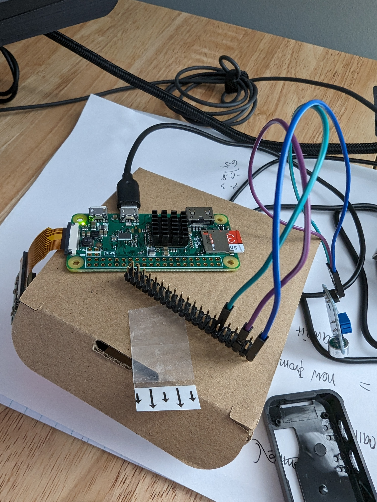 | 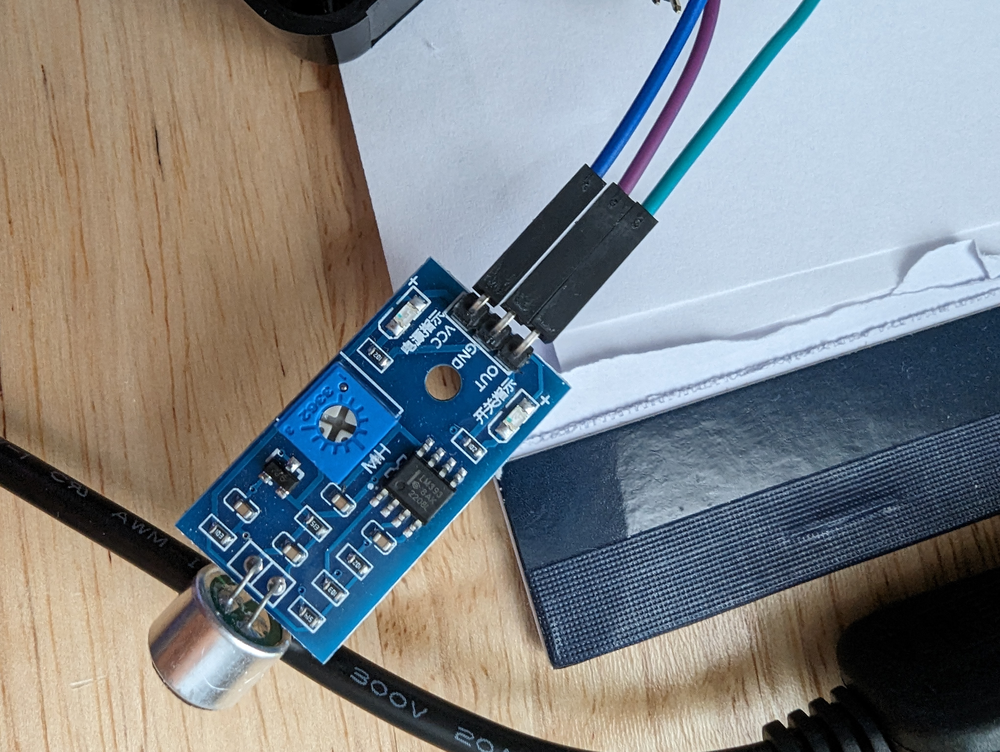          |
| ------------------------------------------ | --------------------------------------------------- |
| 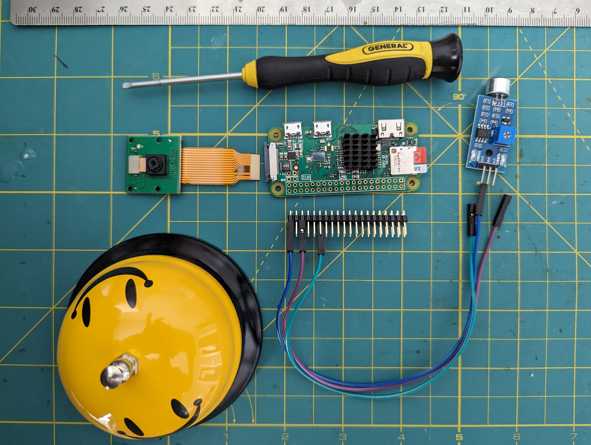 | 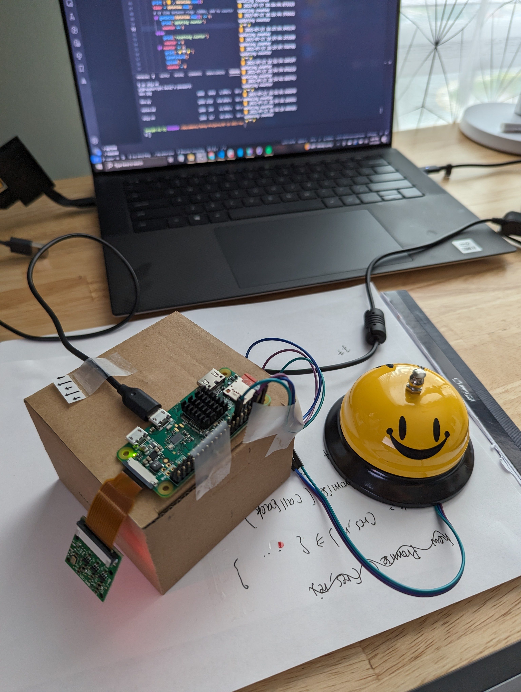          |
| 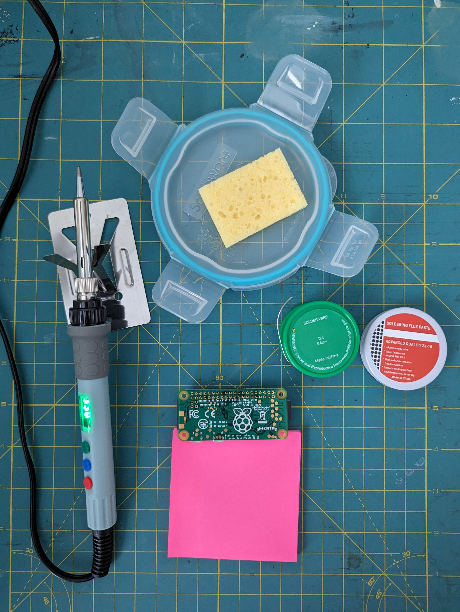 |  |
| 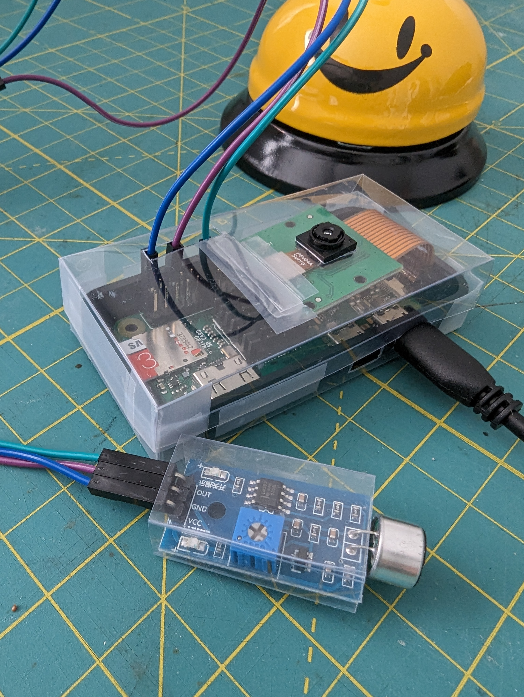 | 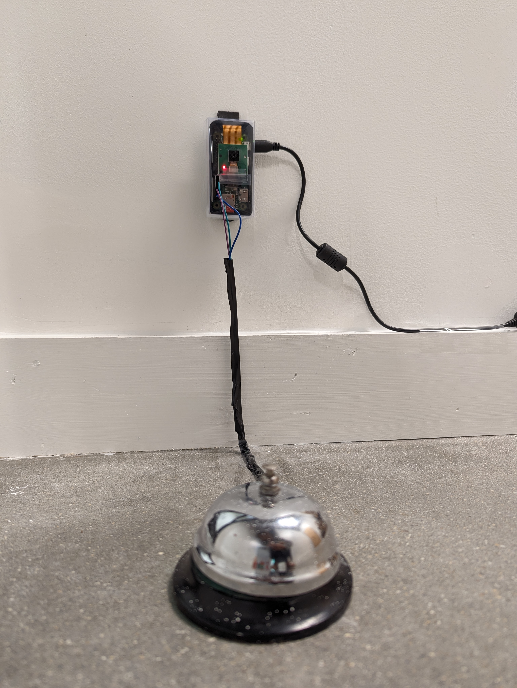          |

# Result

| 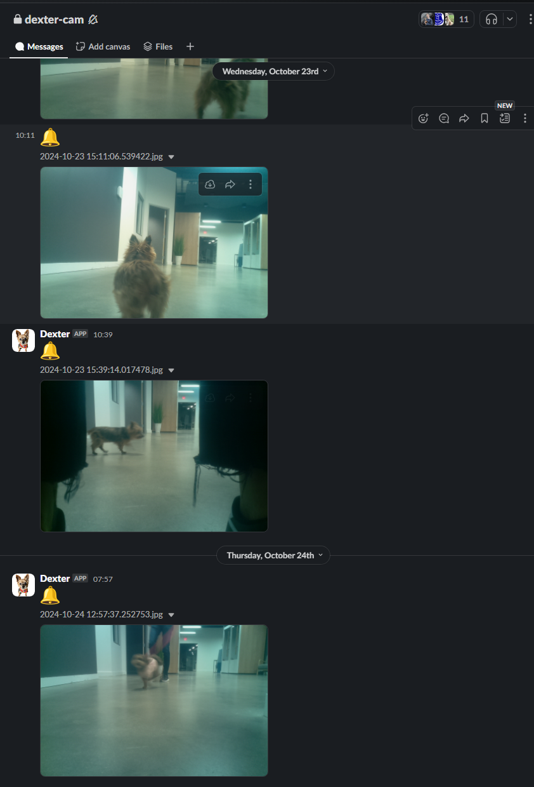                      | 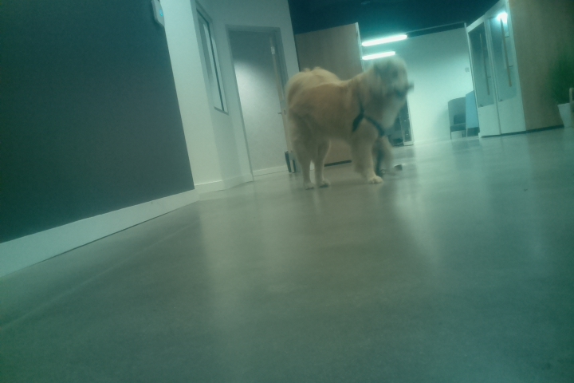 |
| --------------------------------------------------------- | --------------------------------------------------------- |
| 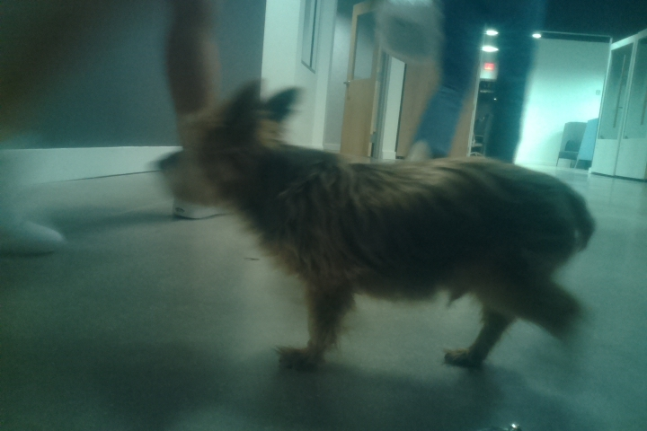 | 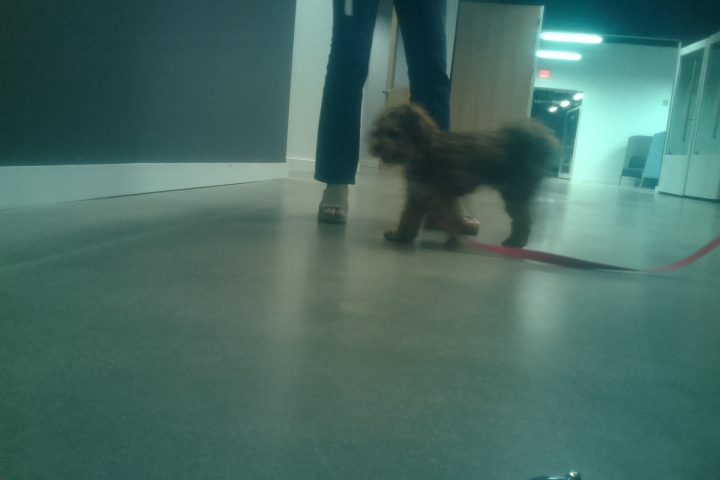 |
